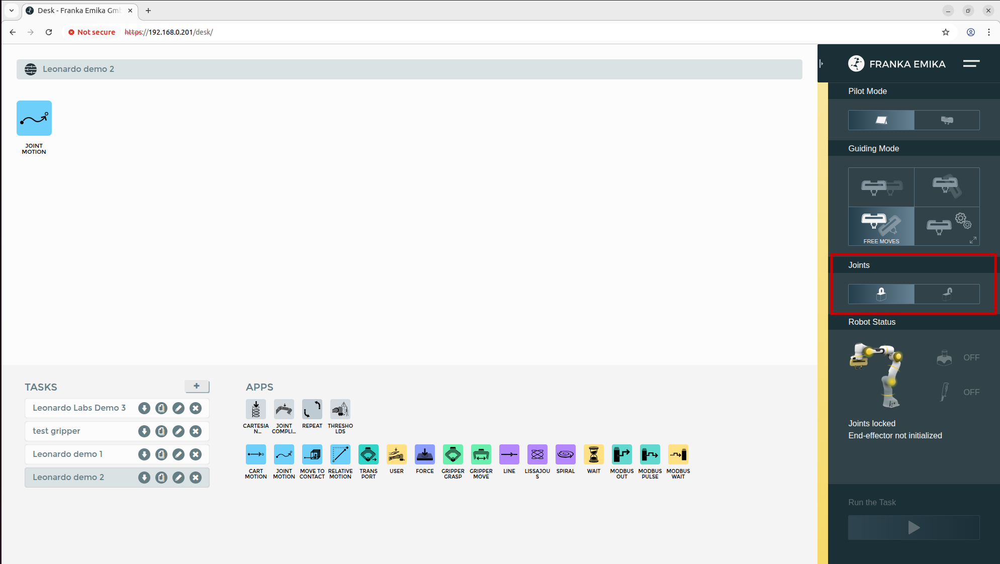
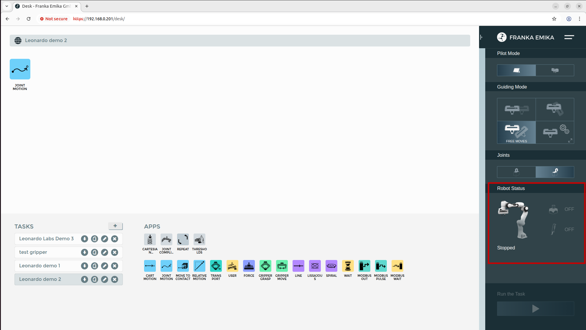
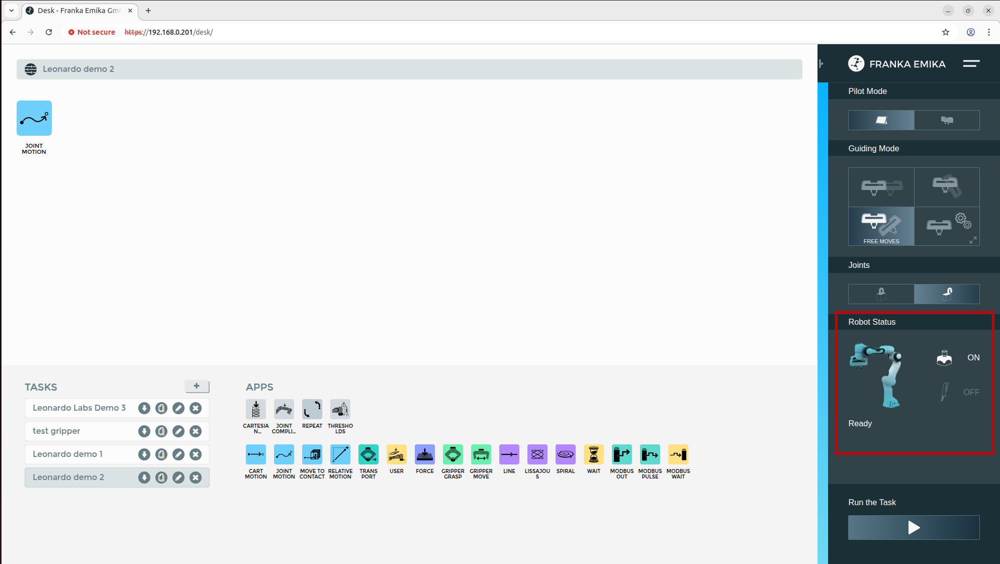
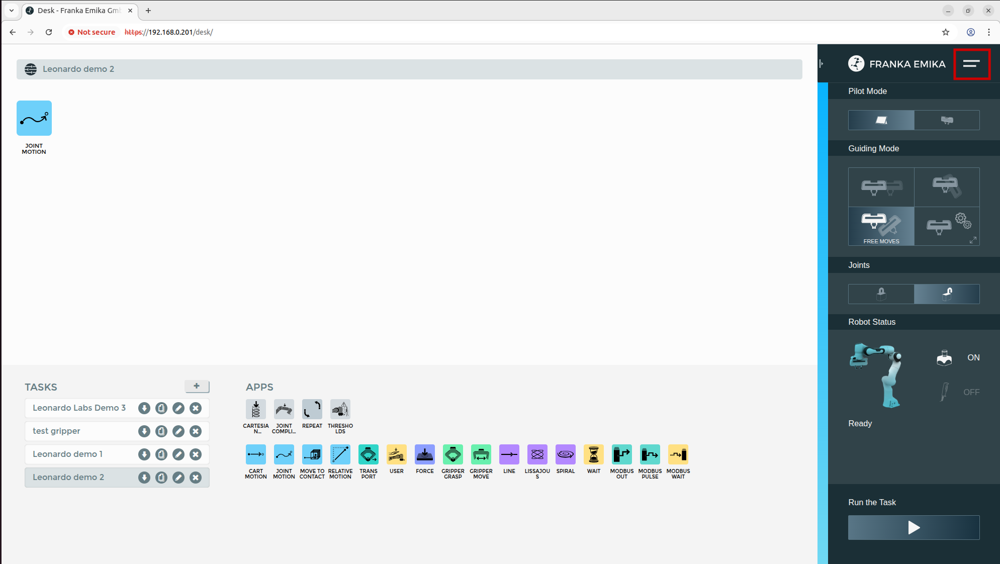
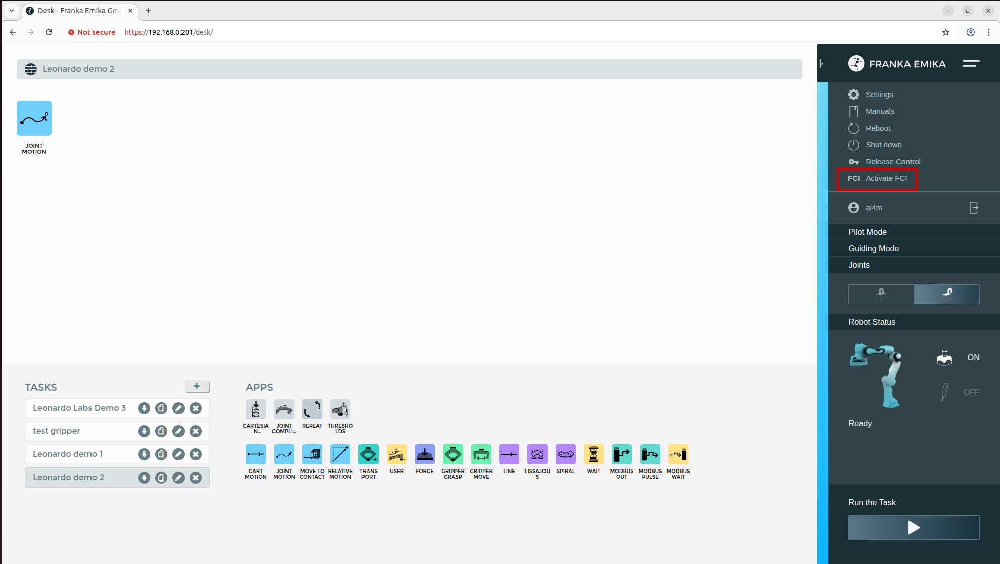
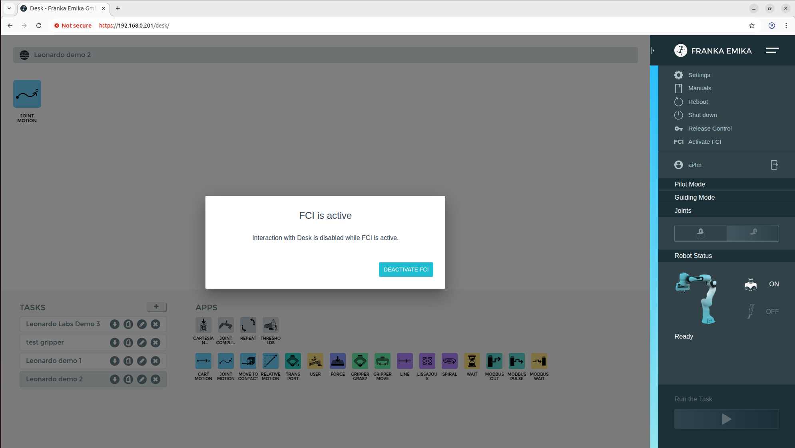

# Interfacing ROS2 with the Franka Emika Panda via Franka Control Interface (FCI)
This guide helps you setup a connection and command Franka Emika Panda robots of Leonardo Innovation Hub using ROS2 and the Franka Control Interface (FCI).

## Contents
- [Powering On the Robot](#powering-on-the-robot)
- [Connection Setup](#connection-setup)
- [Franka Desk](#franka-desk)
- [External Buttons](#external-buttons)
- [Activating FCI](#activating-fci)
- [Run an Example Controller](#run-an-example-controller)

## Powering On the Robot
Two identical Franka Emika Panda robots are available for usage. Their respective control boxes are place underneath the table where they are mounted.
To power on one of the robots, simply press the start button placed at the back of the corresponding control box.

Once you do so, the two led strips at the base of the robot will start to blink yellow.
Once the leds stop blinking, the robot is ready for usage but its brakes still need to be released.

This can be easily done through ``Franka Desk`` once we establish a connection between the robot and our pc.

## Connection Setup
The robots and your pc can be connected via ethernet as follows:
1. Connect the robot you want to control to your PC via the dedicated ethernet cable.
2. Set your PC's static IP to ``192.168.0.200``
3. Ping the robot you want to control to test the connection (IP addresses for the robots are found on the back of the base joint):
```bash
# Example for robot with IP 192.168.0.201
ping 192.168.0.201
```

Once this step is completed, you can proceed to releasing the brakes of the robot via Franka Desk.

## Franka Desk
Franka Desk is the application used to program and monitor the state of Franka robots.
For a complete guide on the usage of the desk and how it can be used to program Franka robots please refer to [Franka's Official Video Tutorials](https://www.youtube.com/playlist?list=PL9FoYHNFGS3TyHsLcL0-qNIi-e14Xw7np).

1. **Open Desk**:
Open a web browser (Desk is supported on Safari, Chrome and Firefox) and type in the search bar the IP of the robot to which you're connected.
This will open up the desk app on your pc.

2. **Release the Brakes**
Once you're logged in, you can release the brakes by clicking on the ``open lock`` icon found on the right under the joints tab.
<p align="center">
  
</p>
You will hear a clicking sound which are the brakes being released. The robot leds will then turn either blue or white depending on the state of the external buttons as explained in the following section.

**Notes**
- If it's the first time you access the desk app, the system may require username and password. These can be found in the Leonardo Innovation Hub Github repository.
  If you don't have access to that part of the repository please ask your supervisor.
- While navigating to Desk, it may be necessary to bypass a security message telling you that the connection you want to establish is not secure.

## External Buttons
Each robot is provided with two external buttons which are connected to it:
- **Black Button:** By pressing or releasing the black button it is possible to toggle between two robot states indicated by the color that the leds at the Franka base assume:
  - **White Led:** Stopped mode active. In this case it is possible to move the robot with hand guiding or to jog it from desk. It is not possible to command it from an external pc or to run programs made with Desk.
  <p align="center">
    
  </p>

  - **Blue Led:** Automatic mode is enabled. In this case it is possible to run programs made with the Desk app or to command the robot through FCI.
  Make sure to stand clear of the robot before executing any programs.
  <p align="center">
    
  </p>
- **Red Button:** By pressing the red button the robot goes into emergency stop, cutting the power to the motors and inserting the brakes. When releasing, motors will again be turned on leading to the state where motors are on but brakes are inserted (yellow led light). You can unlock the brakes through the Desk app as explained [here](#franka-desk).

## Activating FCI
To control the Franka Emika Panda Robot with ROS 2 you need to enable FCI from the Franka Desk app.

First make sure that the robot is in automatic mode (blue led light), then go to the Desk app and select ``Activate FCI``.
<p align="center">


</p>

A message should pop up telling you that while FCI is active, desk cannot be used.

  <p align="center">
    
  </p>

To turn off FCI, simply click on the ``Deactivate FCI`` button.

## Run an Example Controller
This section is a tutorial on how to run the ``move_to_start_example_controller`` found in the ``franka_example_controllers`` package.
With the robot in manual mode, use the hand guiding functionality to place the robot in a configuration of your choice. Please refer to [Franka's Official Video Tutorials](https://www.youtube.com/playlist?list=PL9FoYHNFGS3TyHsLcL0-qNIi-e14Xw7np) to use hand-guiding on the robot.

Now release the black button to activate automatic mode (blue led) and enable FCI as explained in the previous section.

Open a terminal and enter the workspace where you cloned ``franka_ros2`` and source it:
```bash
cd ~/franka_ros2_ws
source install/setup.bash
```

Finally run the controller with the following command:
```bash
ros2 launch franka_bringup move_to_start_example_controller.launch.py robot_ip:=192.168.0.201 arm_id:=fer load_gripper:=true

```
The robot should move back to a default start configuration.

**Attention:** The various controllers inside the ``franka_example_controllers`` package will only work if you pass as launch argument
``arm_id:=fer`` which stands for `Franka Emika Panda`. This is because launchers are generic and will also work with the newer Franka R
esearch 3 (fr3) robots.